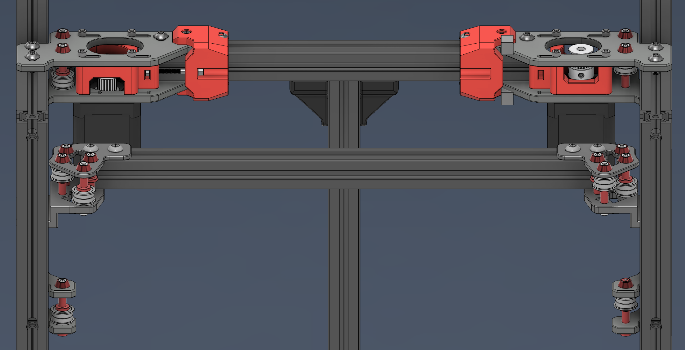

# Aluminum Gantry for Voron Trident

## 6mm belts

CNC version

  

LASER cut version

  

## 9mm belts

  

Because the belts are extended 3mm upwards and 3mm downwards (keeping the distance in between both belts as stock), the rear Z extrusion needs to be filed to allow clearance for the bottom belt, otherwise it will touch both extrusion and rear Z brackets. New Z brackets are available in the STL folder for 9mm belts.

  

### Changelog

- 07/09/2024 - Added Steve's circlip mod for 38mm shafts (usermods/Steve/A_Drive_Rear_9mm_38mmStepper_Circlip.step)